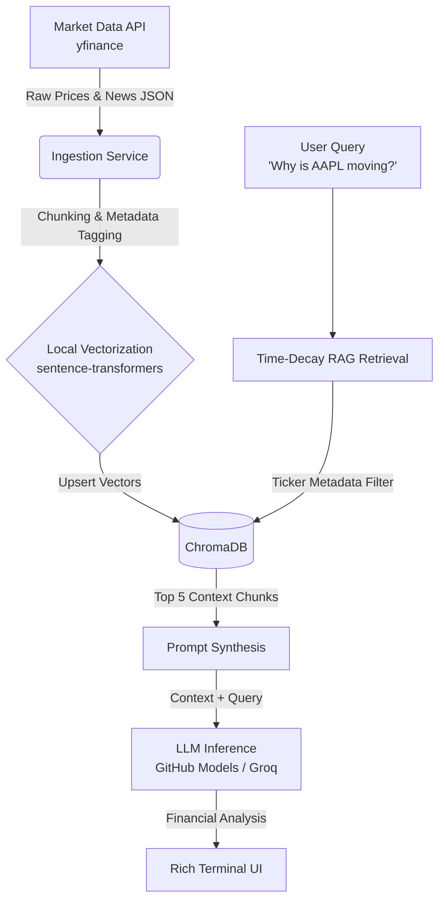

# Market RAG Terminal

> **Real-time financial due diligence terminal powered by local RAG, ticker metadata filtering, and live market data.**

This project demonstrates a production-grade, zero-cost AI architecture for financial analysis. It continuously polls live market data and news, embedding the information locally to provide context-aware, up-to-the-minute summaries of stock movements via a Terminal UI.

> **Status:** work in progress. The ingestion layer is complete and tested; indexing, retrieval, synthesis and the dashboard are on the [roadmap](#roadmap).

## System Architecture



## Core Design Tradeoffs

1. **Local Embeddings over Paid Endpoints:** By running `sentence-transformers` (e.g., `all-MiniLM-L6-v2`) locally on the CPU, we eliminate API latency and cost during the dense vectorization phase. This proves that high-quality retrieval does not require expensive OpenAI embedding credits.
2. **Metadata Filtering over Prompt Stuffing:** Dumping arbitrary news into a vector database leads to cross-contamination (e.g., Apple news affecting a Microsoft query). This architecture strictly enforces metadata filtering by ticker symbol at the retrieval layer before performing similarity search.
3. **Time-Decay Reranking:** In financial markets, context from 3 hours ago is vastly more valuable than context from 3 days ago. The retrieval pipeline implements a temporal decay penalty to ensure the LLM only reasons over the most current events.
4. **Relevance Filtering at Ingestion:** Metadata filtering is only as good as the tags it filters on. Yahoo's search results are keyword-based, and its `relatedTickers` field lists the searched ticker on nearly every result, even for articles that are really about other companies. Tagging everything with the searched ticker would put e.g. Netflix news under `AAPL` and defeat the retrieval filter. Ingestion therefore keeps an article only if its title or summary mentions the ticker symbol or a configured company alias (`ticker_aliases` in `src/config.py`). This is a deliberate precision-over-recall heuristic: it can miss articles that mention a company only in the body.

## What's Implemented

### Ingestion (`src/ingestion/`)

- **`fetcher.py`** fetches price snapshots and news via `yfinance` and normalizes them into the Pydantic models in `src/schemas.py`.
  - Handles both yfinance news formats and always outputs timezone-aware **UTC** timestamps (required for time-decay scoring).
  - News uses `yf.Search` as the primary source, with `Ticker.news` as fallback, because `Ticker.news` was observed returning empty lists.
  - Stable per-article IDs (`article_id`) are used for deduplication and later as vector-store IDs, so re-polling upserts instead of duplicating.
- **`poller.py`** (`MarketPoller`) polls all configured tickers on a background thread.
  - Deduplicates articles across polling cycles and passes only unseen ones to an `on_new_articles` callback (the hook for the indexer).
  - One failing ticker is logged and skipped; it never stops the loop.
  - Keeps the latest price snapshot per ticker for the UI to read.

### Tests

```bash
python -m pytest -q
```

All yfinance calls are mocked, so the suite needs no network. It covers format parsing, malformed items, ID stability, the relevance filter, search fallback, deduplication, and failure isolation.

### Try ingestion today

```bash
python -c "from src.ingestion.fetcher import fetch_snapshot, fetch_news; print(fetch_snapshot('AAPL')); [print(a.publish_time, a.publisher, '|', a.title) for a in fetch_news('AAPL')]"
```

## Configuration

Settings live in `src/config.py` and can be overridden through `.env`:

| Setting | Default | Purpose |
| --- | --- | --- |
| `default_tickers` | AAPL, MSFT, NVDA, GOOGL, AMZN | Stocks to track |
| `ticker_aliases` | company names per ticker | Used by the news relevance filter. Add an entry when adding a ticker |
| `poll_interval_seconds` | `180` | Time between polling cycles |
| `news_per_ticker` | `10` | Max articles kept per ticker per cycle |
| `llm_base_url` / `llm_model` / `llm_api_key` | GitHub Models, `gpt-4o-mini` | LLM endpoint (used from the synthesis step) |
| `chroma_db_dir` | `./chroma_db` | Local vector store location |

## Local Setup Guide

### 1. Clone & Environment Setup

```bash
git clone https://github.com/victoriaberg/market-rag-terminal.git
cd market-rag-terminal
python3 -m venv .venv
source .venv/bin/activate  # On Windows use: .venv\Scripts\activate
```

### 2. Install Dependencies

```bash
pip install -e .
pip install pytest  # to run the tests
```

### 3. Configure Environment Variables

Copy the example environment file and add your free GitHub Models or Groq API key (only needed from the LLM synthesis step onward):

```bash
cp .env.example .env
```

### 4. Run the Terminal Dashboard

> Coming with the Rich dashboard milestone (the entry point does not exist yet).

```bash
python -m src.main
```

## Roadmap

- [x] Ticker & news polling ingestion (`yfinance`)
- [ ] ChromaDB vector indexing with ticker metadata
- [ ] Time-decay relevance reranking
- [ ] LLM financial synthesis prompt
- [ ] Interactive Rich terminal layout