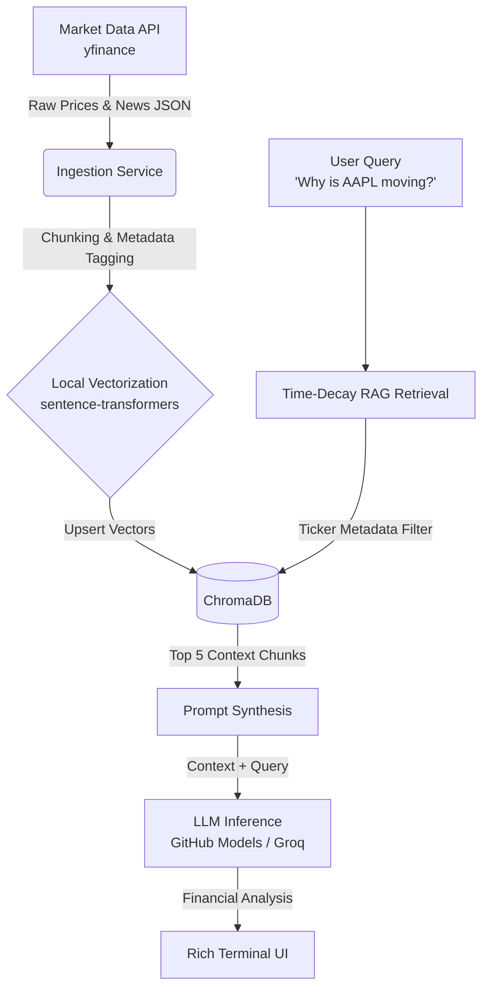

# Market RAG Terminal

> **Real-time financial due diligence terminal powered by local RAG, ticker metadata filtering, and live market data.**

This project demonstrates a production-grade, zero-cost AI architecture for financial analysis. It continuously polls live market data and news, embedding the information locally to provide context-aware, up-to-the-minute summaries of stock movements via a Terminal UI.

## System Architecture



## Core Design Tradeoffs

1. **Local Embeddings over Paid Endpoints:** By running `sentence-transformers` (e.g., `all-MiniLM-L6-v2`) locally on the CPU, we eliminate API latency and cost during the dense vectorization phase. This proves that high-quality retrieval does not require expensive OpenAI embedding credits.
2. **Metadata Filtering over Prompt Stuffing:** Dumping arbitrary news into a vector database leads to cross-contamination (e.g., Apple news affecting a Microsoft query). This architecture strictly enforces metadata filtering by ticker symbol at the retrieval layer before performing similarity search.
3. **Time-Decay Reranking:** In financial markets, context from 3 hours ago is vastly more valuable than context from 3 days ago. The retrieval pipeline implements a temporal decay penalty to ensure the LLM only reasons over the most current events.

## Local Setup Guide

### 1. Clone & Environment Setup

```bash
git clone https://github.com/YOUR_USERNAME/market-rag-terminal.git
python3 -m venv .venv
source .venv/bin/activate  # On Windows use: .venv\Scripts\activate
```

### 2. Install Dependencies

```bash
pip install -e .
```

### 3. Configure Environment Variables

Copy the example environment file and add your free GitHub Models or Groq API key:

```bash
cp .env.example .env
```

### 4. Run the Terminal Dashboard

```bash
python -m src.main
```

## Roadmap

- [ ] Ticker & news polling ingestion (`yfinance`)
- [ ] ChromaDB vector indexing with ticker metadata
- [ ] Time-decay relevance reranking
- [ ] LLM financial synthesis prompt
- [ ] Interactive Rich terminal layout